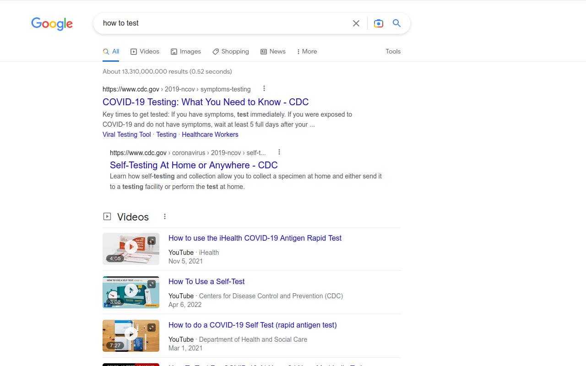
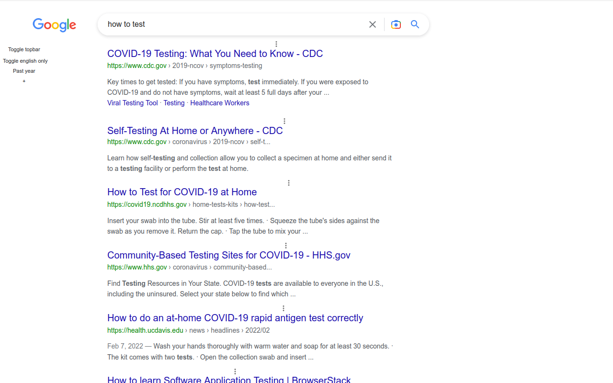

# Google Cleaner
Declutter, focus on most used actions, collapses seldom used ones, easier title scanning.

### Before

### After

## Install
[Userscript][1] - [Firefox][2] - [Chrome][3].

## Changes
- **topbar** (All, Videos, News...) to the sidebar
- **shortcuts** to common actions: results from Past Year, results only in English
- **old style links**, easier to ignore them when scanning titles

### Rich text content hidden
- Images
- Videos
- People also ask
- Twitter results
- Top stories
- Related searches

## Recommended
[uBlacklist][4] is a life changer, it prevents the sites you specify from appearing in the search results

[Contributing](https://github.com/icetbr/my-projects/blob/main/CONTRIBUTING.md)\
[License (MIT)](https://choosealicense.com/licenses/mit/)

[1]: https://openuserjs.org/scripts/icetbr/Google_Cleaner
[2]: https://addons.mozilla.org/en-US/firefox/addon/google-cleaner
[3]: https://chrome.google.com/webstore/detail/google-cleaner/eipbokcgljcghpakakmjinohkloboifg
[4]: https://addons.mozilla.org/en-US/firefox/addon/ublacklist/
